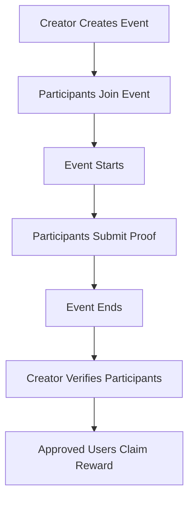

# 🌟 SuiLife - Real-Life Quest Platform

**Complete real-life missions and get rewarded with SUI on the Sui blockchain.**

---

## 📖 Overview

**SuiLife** is a decentralized Web3 application that bridges real-world activities with blockchain rewards. The platform incentivizes real-life activities like exercise, healthy habits, and productivity challenges with crypto rewards.

### ✨ Key Features

- 🎯 **Create Quests** - Design missions with custom requirements, rewards, and deadlines
- 🏃 **Join & Complete** - Participate in quests and submit proof of completion
- ✅ **Verification System** - Quest creators verify participant submissions
- 💰 **Claim Rewards** - Verified participants claim SUI rewards
- 📊 **Dashboard** - Track your created quests and participation status

---

## 🔄 User Flow

### For Quest Creators

1. Connect your Sui wallet
2. Navigate to "Create Quest"
3. Fill in quest details (title, description, requirements, reward, deadline)
4. Pay the reward pool in SUI
5. Verify participant submissions from your dashboard

### For Participants

1. Connect your Sui wallet
2. Browse available quests in "Explore Events"
3. Join a quest you want to complete
4. Complete the real-life mission
5. Submit proof of completion
6. Wait for creator verification
7. Claim your SUI reward!

---

## 📦 Deployed Contracts (Testnet)

| Contract       | Package ID                                                           |
| -------------- | -------------------------------------------------------------------- |
| **LIFE Token** | `0x69f585ff94a49807d1b385d7e05a08cc01f5622ade69fee17aa6d885b545b0a6` |
| **SuiLife**    | `0x3743b6e4b471ec0c878c3e9a243e3c97392ed0824402dd27f6084fd2ae558bc1` |

---

## 📄 License

This project is open source and available under the [MIT License](LICENSE).

---

**Built with ❤️ on Sui Blockchain**

